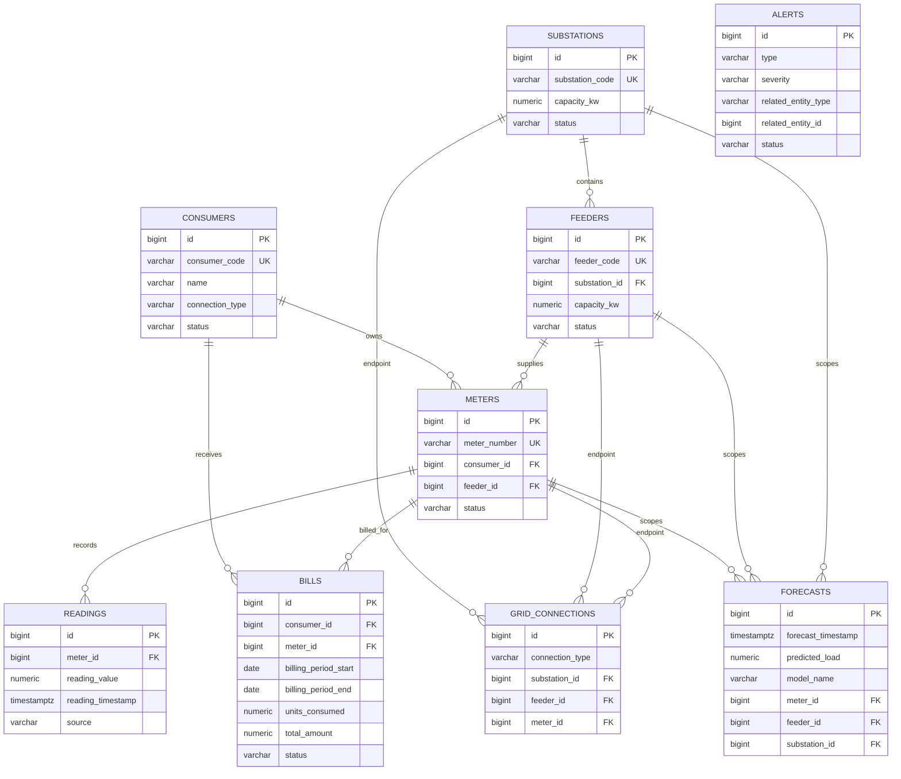

# Database Design

## Purpose

The database stores the operational records required by the Smart Meter Readings System: consumers, their meters, meter readings, bills, distribution-grid structure, forecasts, and operational alerts. The design targets Supabase PostgreSQL and keeps the data model normalized enough for an academic DBMS project while remaining straightforward for Spring Data JPA.

The schema is structure-only at this stage. It does not connect to Supabase, contain credentials, or insert production/demo data.

## Migration Files

- `database/migrations/001_initial_schema.sql` creates the complete initial relational schema, constraints, foreign keys, and indexes.
- `database/seeds/001_demo_seed.sql` is a deliberately empty, clearly labelled placeholder for future development data. It is separate from the schema migration.

## Tables

### `consumers`

Stores electricity customers. `consumer_code` is the stable business identifier exposed by the application. `connection_type` is constrained to `RESIDENTIAL`, `COMMERCIAL`, or `INDUSTRIAL`; `status` is constrained to `ACTIVE` or `INACTIVE`.

- Primary key: `id`
- Unique key: `consumer_code`
- Referenced by: `meters`, `bills`

### `meters`

Stores physical or smart electricity meters assigned to consumers. A meter must have one consumer and may be assigned to one feeder. `meter_number` is unique.

- Primary key: `id`
- Foreign keys: `consumer_id -> consumers.id`, `feeder_id -> feeders.id`
- Status values: `ONLINE`, `OFFLINE`, `MAINTENANCE`

### `readings`

Stores cumulative meter readings and their source. Values cannot be negative. A meter cannot have two readings with the same timestamp, which protects ingestion idempotency at the database boundary.

- Primary key: `id`
- Foreign key: `meter_id -> meters.id`
- Source values: `SMART_METER`, `MANUAL`, `IMPORTED`
- Unique key: `(meter_id, reading_timestamp)`

### `bills`

Stores billing results for a consumer and meter over a billing period. Tariff rules are intentionally absent; the backend will calculate charges later. Reading and charge fields are persisted as the values used to produce the bill.

- Primary key: `id`
- Foreign keys: `consumer_id -> consumers.id`, `meter_id -> meters.id`
- Status values: `DRAFT`, `GENERATED`, `PAID`, `OVERDUE`
- Unique key: `(meter_id, billing_period_start, billing_period_end)`

### `substations`

Stores distribution substations and their rated capacity in kilowatts.

- Primary key: `id`
- Unique key: `substation_code`
- Status values: `ACTIVE`, `INACTIVE`, `MAINTENANCE`

### `feeders`

Stores distribution feeders. Each feeder belongs to exactly one substation and has its own capacity and status.

- Primary key: `id`
- Foreign key: `substation_id -> substations.id`
- Unique key: `feeder_code`

### `grid_connections`

Stores supported topology edges for future grid visualization. It intentionally supports only:

- `SUBSTATION_FEEDER`: one substation and one feeder
- `FEEDER_METER`: one feeder and one meter

A shape check prevents a row from mixing edge types or carrying unrelated endpoints. The ownership columns in `feeders` and `meters` remain the authoritative relationships; this table is a small topology projection that can later support connection history through `connected_at` and `disconnected_at`.

- Primary key: `id`
- Foreign keys: endpoint IDs to `substations`, `feeders`, and `meters`
- Unique active connections: `(substation_id, feeder_id)` and `(feeder_id, meter_id)` through partial indexes; disconnected historical connections may be retained.

### `forecasts`

Stores predictions produced by a future forecasting process. It contains no prediction logic. A row can be system-level when all three scope IDs are null, or scoped to exactly one meter, feeder, or substation. `predicted_load` cannot be negative.

- Primary key: `id`
- Optional foreign keys: `meter_id`, `feeder_id`, `substation_id`
- Scope check: at most one scope foreign key may be populated

### `alerts`

Stores operational alerts and their lifecycle. Alerts may be system-level or refer to an entity using the requested `related_entity_type` and `related_entity_id` pair. Because PostgreSQL cannot enforce one foreign key against several tables, the polymorphic target is validated by the service layer; the database still constrains the allowed entity type and requires the pair to be complete.

- Primary key: `id`
- Type values: `CAPACITY`, `METER`, `CONSUMPTION`, `FORECAST`, `SYSTEM`
- Severity values: `INFO`, `WARNING`, `CRITICAL`
- Status values: `OPEN`, `ACKNOWLEDGED`, `RESOLVED`
- Resolution check: resolved alerts require `resolved_at`; other statuses do not allow it

## Relationships

- One consumer has many meters: `consumers 1 -> N meters`
- One meter has many readings: `meters 1 -> N readings`
- One consumer has many bills: `consumers 1 -> N bills`
- One meter has many bills: `meters 1 -> N bills`
- One substation has many feeders: `substations 1 -> N feeders`
- One feeder can have many meters: `feeders 1 -> N meters`
- Grid connections represent substation-to-feeder and feeder-to-meter topology edges.
- A forecast optionally targets one meter, feeder, or substation, or the whole system.
- An alert optionally refers to one domain entity through its validated type and ID pair.

## Constraints and Data Integrity

- All tables use identity-backed `BIGINT` primary keys.
- Business identifiers for consumers, meters, substations, and feeders are unique.
- Required relationships use `NOT NULL` foreign keys where ownership is mandatory.
- Numeric readings, loads, capacities, charges, and consumption values have non-negative checks; capacities must be positive.
- Billing dates must form a valid period, and current readings cannot be lower than previous readings.
- Bills use a composite foreign key to ensure their consumer is the consumer assigned to their meter.
- Reading timestamps are unique per meter.
- Active grid connection endpoint combinations are unique and must match their declared type; disconnected history can be retained.
- PostgreSQL `TIMESTAMPTZ` is used for event and audit timestamps; billing periods use `DATE`.
- Deletes default to restrictive behavior for core ownership relationships. Topology rows cascade when their endpoint is deleted because they are a dependent projection.

## Indexes

The migration adds indexes for the common access paths:

- Feeder lookup by substation
- Meter lookup by consumer and feeder
- Reading lookup by meter and by timestamp
- Bill lookup by consumer, meter, and billing period
- Grid topology lookup by feeder and meter
- Forecast lookup by forecast time and target scope
- Alert lookup by status, type/severity, and related entity

The unique constraints also create indexes automatically where appropriate. Indexes should be revisited after real query patterns are available.

## Normalization Decisions

The model is in a practical normalized form:

- Consumer, meter, feeder, and substation attributes are stored once in their owning tables.
- Readings are separate time-series rows instead of repeated columns on meters.
- Bills store billing-period snapshots and calculated amounts, not tariff definitions or duplicated consumer profile data.
- Grid topology is separate from entity ownership so future connection history does not require changing core entity tables.
- Forecast scope uses nullable foreign keys with a check rather than duplicating separate forecast tables for each grid level.
- Alerts keep the requested flexible reference pair because one alert can target several domain types; service-layer validation is documented and constrained at the database boundary.

## Main Business Flow

```text
Consumer
  -> Meter
  -> Reading history
  -> Consumption aggregation
  -> Bill

Substation
  -> Feeder
  -> Meter

Reading history
  -> Forecast input
  -> Capacity analysis
  -> Alert
```

## ER Diagram



`ALERTS` is not drawn with a database-enforced foreign-key edge because its polymorphic reference is validated by the backend service layer rather than pointing to one fixed table.

## Aggregation and Analysis Support

The schema supports SQL analytics without storing redundant aggregate columns:

```sql
-- Total consumption for each meter during a period.
SELECT meter_id, SUM(units_consumed) AS total_units
FROM bills
WHERE billing_period_start >= DATE '2026-01-01'
  AND billing_period_end < DATE '2027-01-01'
GROUP BY meter_id;

-- Average, maximum, and minimum reading by meter.
SELECT meter_id,
       AVG(reading_value) AS average_reading,
       MAX(reading_value) AS peak_reading,
       MIN(reading_value) AS minimum_reading,
       COUNT(*) AS reading_count
FROM readings
GROUP BY meter_id;

-- Join consumers, meters, and recent readings for an operational view.
SELECT c.consumer_code, m.meter_number, r.reading_value, r.reading_timestamp
FROM consumers c
JOIN meters m ON m.consumer_id = c.id
JOIN readings r ON r.meter_id = m.id
WHERE r.reading_timestamp >= CURRENT_TIMESTAMP - INTERVAL '30 days';
```

Date-based analysis can use `DATE_TRUNC` on `readings.reading_timestamp` or billing-period dates. Capacity analysis can join feeder/substation capacity with grouped readings or forecast loads. `SUM`, `AVG`, `MAX`, `MIN`, `COUNT`, `GROUP BY`, and `JOIN` are all supported by the normalized design.

## Spring Boot and Supabase Integration Later

1. Apply the migration to the Supabase PostgreSQL database through a controlled migration workflow.
2. Configure Spring Boot with environment-provided JDBC URL, username, and password; never commit credentials.
3. Map the tables to JPA entities using explicit table and column names.
4. Use repositories for persistence and service classes for billing, aggregation, alert validation, and business rules.
5. Keep Hibernate schema generation disabled or validation-only in deployed environments so migrations remain the source of truth.
6. Add API-level authorization and Supabase Row Level Security policies when the authentication design is implemented.

## Row Level Security Strategy

RLS is not enabled in this initial schema migration because Spring Boot is planned as the controlled API boundary and authentication is a later step. Before exposing tables directly through Supabase clients, enable RLS per table and add role-based policies. The initial policy direction should be:

- Authenticated application users can access only the operations permitted by their role.
- Anonymous access remains denied.
- Service-role or migration access is kept separate from end-user access.
- Policies should be tested alongside authentication rather than guessed during schema setup.
